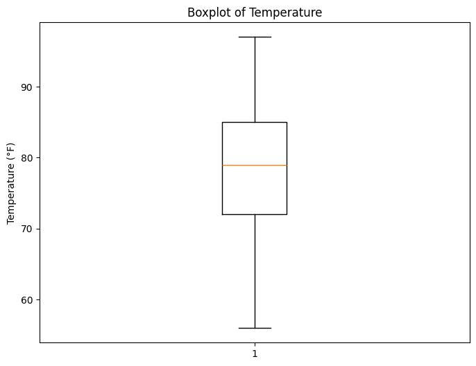
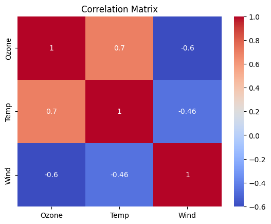

```python
import numpy as np
arr = np.array([1,2,3,4,5])
```


```python
my_list = [1, 2, 3, 4, 5]
```


```python
import pandas as pd
data = {'Ozone': [41, 36, 12], 'Temp': [67, 72, 74]}
df = pd.DataFrame(data)
```


```python
df = pd.read_csv('C:\\Users\\rdudley\\Downloads\\airquality_datasets.csv')
```


```python
# Summary of the dataset
print(df.info())
print(df.describe())
```

    <class 'pandas.core.frame.DataFrame'>
    RangeIndex: 153 entries, 0 to 152
    Data columns (total 6 columns):
     #   Column   Non-Null Count  Dtype  
    ---  ------   --------------  -----  
     0   Ozone    116 non-null    float64
     1   Solar.R  146 non-null    float64
     2   Wind     153 non-null    float64
     3   Temp     153 non-null    int64  
     4   Month    153 non-null    int64  
     5   Day      153 non-null    int64  
    dtypes: float64(3), int64(3)
    memory usage: 7.3 KB
    None
                Ozone     Solar.R        Wind        Temp       Month         Day
    count  116.000000  146.000000  153.000000  153.000000  153.000000  153.000000
    mean    42.129310  185.931507    9.957516   77.882353    6.993464   15.803922
    std     32.987885   90.058422    3.523001    9.465270    1.416522    8.864520
    min      1.000000    7.000000    1.700000   56.000000    5.000000    1.000000
    25%     18.000000  115.750000    7.400000   72.000000    6.000000    8.000000
    50%     31.500000  205.000000    9.700000   79.000000    7.000000   16.000000
    75%     63.250000  258.750000   11.500000   85.000000    8.000000   23.000000
    max    168.000000  334.000000   20.700000   97.000000    9.000000   31.000000
    


```python
import matplotlib.pyplot as plt

# Ozone Histogram
plt.figure(figsize=(8, 6))
plt.hist(df['Ozone'].dropna(), bins=20, color='blue', edgecolor='black')
plt.title('Distribution of Ozone Levels')
plt.xlabel('Ozone (ppb)')
plt.ylabel('Frequency')
plt.show()

# Temp Histogram
plt.figure(figsize=(8, 6))
plt.hist(df['Temp'].dropna(), bins=20, color='orange', edgecolor='black')
plt.title('Distribution of Temperature')
plt.xlabel('Temperature (°F)')
plt.ylabel('Frequency')
plt.show()
```


    

    


    

    


```python
# Boxplot for Ozone
plt.figure(figsize=(8, 6))
plt.boxplot(df['Ozone'].dropna())
plt.title('Boxplot of Ozone Levels')
plt.ylabel('Ozone (ppb)')
plt.show()

# Boxplot for Temp
plt.figure(figsize=(8, 6))
plt.boxplot(df['Temp'].dropna())
plt.title('Boxplot of Temperature')
plt.ylabel('Temperature (°F)')
plt.show()
```


    

    


    

    


```python
import seaborn as sns

# Scatter plot with regression line
plt.figure(figsize=(10, 6))
sns.scatterplot(x='Temp', y='Ozone', hue='Month', data=df)
plt.title('Temperature vs Ozone Levels by Month')
plt.xlabel('Temperature (°F)')
plt.ylabel('Ozone (ppb)')
plt.show()

# Correlation matrix
corr = df[['Ozone', 'Temp', 'Wind']].corr()
sns.heatmap(corr, annot=True, cmap='coolwarm')
plt.title('Correlation Matrix')
plt.show()
```


    

    


    

    

